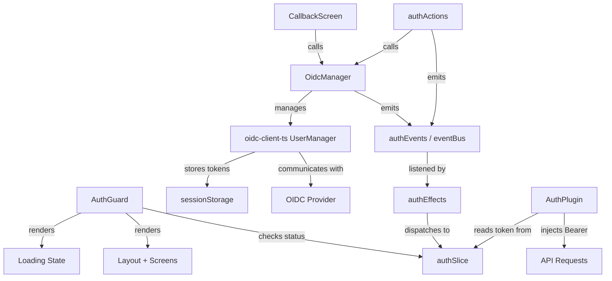
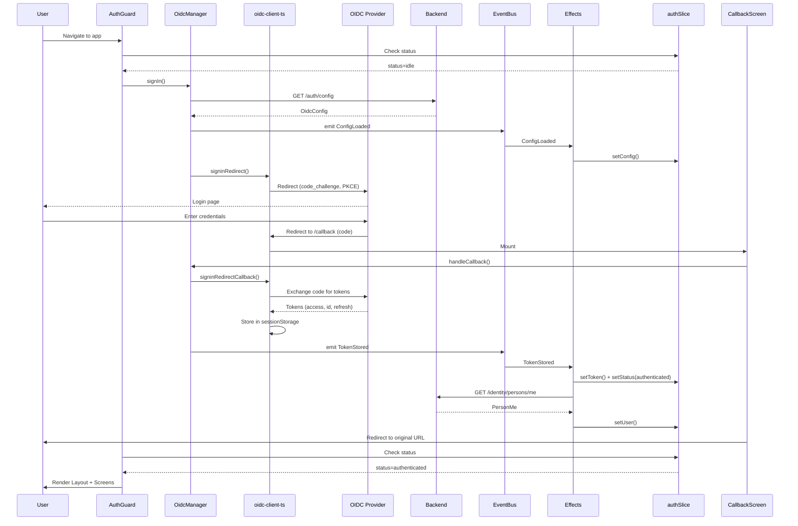
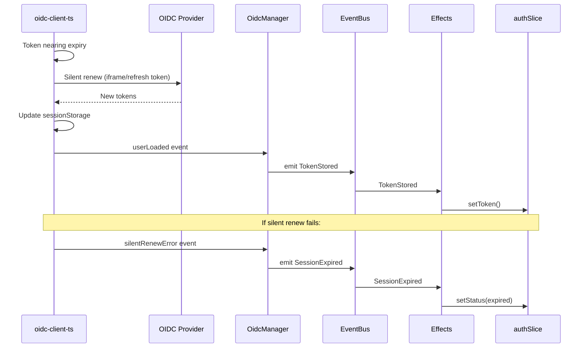
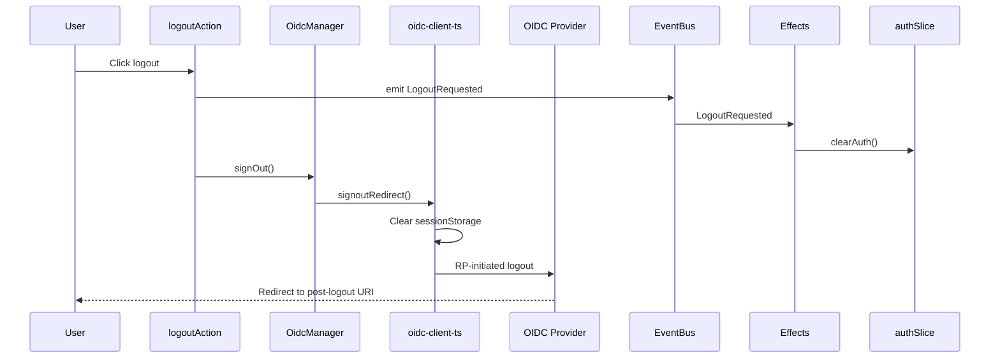

# Technical Design — Auth

<!-- toc -->

- [1. Architecture Overview](#1-architecture-overview)
  - [1.1 Architectural Vision](#11-architectural-vision)
  - [1.2 Architecture Drivers](#12-architecture-drivers)
  - [1.3 Architecture Layers](#13-architecture-layers)
- [2. Principles & Constraints](#2-principles--constraints)
  - [2.1 Design Principles](#21-design-principles)
  - [2.2 Constraints](#22-constraints)
- [3. Technical Architecture](#3-technical-architecture)
  - [3.1 Domain Model](#31-domain-model)
  - [3.2 Component Model](#32-component-model)
  - [3.3 API Contracts](#33-api-contracts)
  - [3.4 Internal Dependencies](#34-internal-dependencies)
  - [3.5 External Dependencies](#35-external-dependencies)
  - [3.6 Interactions & Sequences](#36-interactions--sequences)
  - [3.7 Database schemas & tables](#37-database-schemas--tables)
  - [3.8 Deployment Topology](#38-deployment-topology)
- [4. Additional context](#4-additional-context)
  - [Files to create](#files-to-create)
  - [Files to modify](#files-to-modify)
  - [Environment configuration](#environment-configuration)
- [5. Traceability](#5-traceability)

<!-- /toc -->

- [ ] `p1` - **ID**: `cpt-auth-design-auth`
## 1. Architecture Overview

### 1.1 Architectural Vision

The Auth module integrates `oidc-client-ts` UserManager into the existing HAI3 event-driven architecture. Rather than introducing a separate auth context or provider tree, the OIDC lifecycle is wired through the same event → effect → slice pattern used by the rest of the application. UserManager handles the OIDC protocol mechanics (redirects, PKCE, token exchange, silent renew), while HAI3 events propagate state changes to Redux and the UI layer.

Token storage uses `sessionStorage` via `oidc-client-ts` built-in WebStorageStateStore, ensuring tokens survive page reloads within the same browser tab but are cleared when the tab closes. The callback route is a lightweight screen that completes the code-to-token exchange and redirects the user to their originally requested page.

An AuthGuard component wraps the application layout to enforce authentication before any screen renders. This approach keeps the auth boundary at the top level while individual screens remain unaware of auth mechanics.

### 1.2 Architecture Drivers

#### Functional Drivers

| Requirement | Design Response |
|-------------|------------------|
| `cpt-auth-fr-config-discovery` | OidcManager fetches config via existing AuthApiService, passes to UserManager settings |
| `cpt-auth-fr-login-redirect` | OidcManager.signIn() calls UserManager.signinRedirect() with PKCE |
| `cpt-auth-fr-callback` | CallbackScreen calls UserManager.signinRedirectCallback(), emits TokenStored |
| `cpt-auth-fr-token-storage` | UserManager configured with WebStorageStateStore(sessionStorage) |
| `cpt-auth-fr-silent-renew` | UserManager automaticSilentRenew=true, events piped to authEvents |
| `cpt-auth-fr-protected-routes` | AuthGuard checks auth status before rendering Layout |
| `cpt-auth-fr-logout` | OidcManager.signOut() calls UserManager.signoutRedirect() |
| `cpt-auth-fr-session-expiry` | AuthPlugin 401 + UserManager token expired → SessionExpired event → redirect to login |

#### NFR Allocation

| NFR ID | NFR Summary | Allocated To | Design Response | Verification Approach |
|--------|-------------|--------------|-----------------|----------------------|
| `cpt-auth-nfr-token-security` | No tokens in localStorage/cookies | OidcManager + UserManager config | WebStorageStateStore configured with sessionStorage only | Automated test scanning localStorage/cookies after each flow |
| `cpt-auth-nfr-provider-compat` | Keycloak, Azure AD, Okta, Auth0 | OidcManager config abstraction | All provider differences handled by oidc-client-ts; config from backend | Integration tests against each provider in CI |

### 1.3 Architecture Layers

| Layer | Responsibility | Technology |
|-------|---------------|------------|
| Presentation | AuthGuard, CallbackScreen, loading states | React, @hai3/react |
| Application | OidcManager, auth events/effects/actions | oidc-client-ts, HAI3 eventBus |
| State | Auth state machine (idle → loading → authenticated → expired) | Redux Toolkit (authSlice) |
| Infrastructure | Token storage, HTTP header injection, 401 handling | sessionStorage, AuthPlugin |

## 2. Principles & Constraints

### 2.1 Design Principles

#### Event-Driven Auth State

- [ ] `p1` - **ID**: `cpt-auth-principle-event-driven`

All auth state transitions flow through the HAI3 event system. OidcManager emits events (ConfigLoaded, TokenStored, SessionExpired), effects listen and dispatch to authSlice. No component directly calls UserManager — all interactions go through actions that emit events.

#### Provider-Agnostic Configuration

- [ ] `p1` - **ID**: `cpt-auth-principle-provider-agnostic`

The frontend never hardcodes provider-specific URLs or behaviors. All OIDC parameters come from backend `GET /auth/config`. The `oidc-client-ts` UserManager abstracts provider differences behind a standard OIDC interface.

#### Existing Infrastructure Reuse

- [ ] `p2` - **ID**: `cpt-auth-principle-reuse`

Maximize reuse of existing auth infrastructure (authSlice, authEvents, authEffects, AuthPlugin, AuthApiService). New components (OidcManager, CallbackScreen, AuthGuard) plug into the existing event-driven flow rather than replacing it.

### 2.2 Constraints

#### Library Constraint

- [ ] `p1` - **ID**: `cpt-auth-constraint-library`

MUST use `oidc-client-ts` as the OIDC client library. No wrapper libraries (react-oidc-context) — direct integration with HAI3 event system.

#### Storage Constraint

- [ ] `p1` - **ID**: `cpt-auth-constraint-storage`

Tokens stored in `sessionStorage` only. No `localStorage`, no JavaScript-accessible cookies.

#### HAI3 Architecture Constraint

- [ ] `p1` - **ID**: `cpt-auth-constraint-hai3`

All new auth code MUST follow HAI3 patterns: event-driven flow (action → event → effect → slice), no direct slice dispatch from components, imports via `@hai3/react`.

## 3. Technical Architecture

### 3.1 Domain Model

**Core Types** (located in `src/app/types/`):

| Entity | Description | File |
|--------|-------------|------|
| OidcConfig | OIDC provider configuration (issuer, clientId, redirectUri, scopes) | `src/app/types/auth.ts` |
| AuthState | Redux state shape (token, config, status, user) | `src/app/types/auth.ts` |
| AuthStatus | Status enum: `idle` \| `loading` \| `authenticated` \| `expired` | `src/app/types/auth.ts` |
| PersonMe | Current user identity from backend | `src/app/types/identity.ts` |

**New types to add**:

| Entity | Description | File |
|--------|-------------|------|
| OidcManagerConfig | UserManager settings derived from OidcConfig | `src/app/types/auth.ts` |

**Relationships**:
- OidcConfig → OidcManagerConfig: config discovery produces UserManager settings
- AuthState.status transitions: `idle` → `loading` → `authenticated` ⇄ `expired`
- AuthState.user is populated from PersonMe after successful authentication

### 3.2 Component Model

#### OidcManager

- [ ] `p1` - **ID**: `cpt-auth-component-oidc-manager`

##### Why this component exists

Encapsulates `oidc-client-ts` UserManager lifecycle and translates OIDC events into HAI3 events. Provides a single point of control for all OIDC operations.

##### Responsibility scope

- Initialize UserManager with settings derived from backend OidcConfig
- Expose methods: `signIn()`, `signOut()`, `handleCallback()`, `getUser()`
- Subscribe to UserManager events (userLoaded, userUnloaded, silentRenewError, accessTokenExpired) and emit corresponding HAI3 auth events
- Configure `sessionStorage` as token store

##### Responsibility boundaries

- Does NOT dispatch to Redux directly — emits events only
- Does NOT render UI — pure service layer
- Does NOT handle 401 responses — that is AuthPlugin's responsibility

##### Related components (by ID)

- `cpt-auth-component-auth-guard` — calls OidcManager.signIn() when unauthenticated
- `cpt-auth-component-callback-screen` — calls OidcManager.handleCallback()
- `cpt-auth-component-auth-plugin` — reads tokens from authSlice (populated via OidcManager events)

#### CallbackScreen

- [ ] `p1` - **ID**: `cpt-auth-component-callback-screen`

##### Why this component exists

Handles the OIDC redirect callback at `/callback`, completing the authorization code exchange.

##### Responsibility scope

- Mounted at `/callback` route
- Calls `OidcManager.handleCallback()` on mount
- On success: emits `TokenStored` event, redirects to the originally requested URL (from state parameter)
- On error: shows error message with retry option

##### Responsibility boundaries

- Does NOT store tokens — OidcManager/UserManager handles that
- Does NOT fetch user identity — effects handle that after TokenStored
- Renders only a loading spinner and error state

##### Related components (by ID)

- `cpt-auth-component-oidc-manager` — calls handleCallback()

#### AuthGuard

- [ ] `p1` - **ID**: `cpt-auth-component-auth-guard`

##### Why this component exists

Enforces authentication at the application boundary. Prevents any screen from rendering until the user is verified.

##### Responsibility scope

- Wraps the application Layout
- Reads `authSlice.status` from Redux
- `idle` / `loading`: renders loading spinner
- `authenticated`: renders children (Layout + screens)
- `expired`: triggers OidcManager.signIn() to re-authenticate

##### Responsibility boundaries

- Does NOT manage tokens or OIDC protocol
- Does NOT handle logout — that is an action triggered by UI
- Pure presentational guard with no side effects beyond triggering signIn

##### Related components (by ID)

- `cpt-auth-component-oidc-manager` — calls signIn() when expired

#### AuthPlugin (existing)

- [ ] `p1` - **ID**: `cpt-auth-component-auth-plugin`

##### Why this component exists

Existing REST plugin that injects Bearer tokens into API requests and handles 401 responses.

##### Responsibility scope

- `onRequest()`: inject `Authorization: Bearer {token}` and `X-Tenant-ID` headers
- `onError()`: on 401, emit `SessionExpired` event

##### Responsibility boundaries

- Does NOT manage OIDC flow — reads token from authSlice
- Does NOT redirect user — SessionExpired event triggers effects/AuthGuard

##### Related components (by ID)

- `cpt-auth-component-oidc-manager` — indirectly, via authSlice token populated by OidcManager events

### 3.3 API Contracts

**Contracts**: `cpt-auth-contract-oidc-config`, `cpt-auth-contract-identity`

**Existing endpoints** (no new API contracts needed):

| Method | Path | Description | Stability |
|--------|------|-------------|-----------|
| `GET` | `/auth/config` | Returns OIDC provider configuration | stable |
| `GET` | `/api/v1/identity/persons/me` | Returns current user profile | stable |

### 3.4 Internal Dependencies

| Dependency Module | Interface Used | Purpose |
|-------------------|----------------|----------|
| `authSlice` | Redux slice | Stores auth state (token, config, status, user) |
| `authEvents` | HAI3 eventBus | Typed auth events (ConfigLoaded, TokenStored, SessionExpired) |
| `authEffects` | Effect initializer | Listens to auth events, dispatches to authSlice |
| `AuthApiService` | BaseApiService | Fetches OIDC config from backend |
| `IdentityApiService` | BaseApiService | Fetches current user identity |
| `AuthPlugin` | RestPlugin | Injects Bearer token, handles 401 |

### 3.5 External Dependencies

#### oidc-client-ts

| Dependency | Interface Used | Purpose |
|------------|---------------|---------|
| `oidc-client-ts` | UserManager, WebStorageStateStore, UserManagerSettings | OIDC Authorization Code + PKCE flow, token management, silent renew |

#### OIDC Provider

| Dependency | Interface Used | Purpose |
|------------|---------------|---------|
| OIDC Provider (Keycloak, Azure AD, Okta, Auth0) | OIDC protocol endpoints (authorize, token, endsession) | User authentication, token issuance |

### 3.6 Interactions & Sequences

#### Login Flow

**ID**: `cpt-auth-seq-login`

**Use cases**: `cpt-auth-usecase-first-login`

**Actors**: `cpt-auth-actor-end-user`, `cpt-auth-actor-oidc-provider`, `cpt-auth-actor-backend-api`

#### Silent Renew Flow

**ID**: `cpt-auth-seq-silent-renew`

**Use cases**: `cpt-auth-usecase-silent-renew`

**Actors**: `cpt-auth-actor-end-user`, `cpt-auth-actor-oidc-provider`

#### Logout Flow

**ID**: `cpt-auth-seq-logout`

**Use cases**: `cpt-auth-usecase-logout`

**Actors**: `cpt-auth-actor-end-user`, `cpt-auth-actor-oidc-provider`

### 3.7 Database schemas & tables

Not applicable — frontend SPA, no database.

### 3.8 Deployment Topology

Not applicable — standard SPA deployment, no auth-specific infrastructure. The OIDC provider is managed externally by the customer's IT team.

## 4. Additional context

### Files to create

| File | Purpose |
|------|---------|
| `src/app/auth/OidcManager.ts` | UserManager wrapper, event bridging |
| `src/app/auth/AuthGuard.tsx` | Route protection component |
| `src/screensets/insight/screens/callback/CallbackScreen.tsx` | OIDC callback handler |

### Files to modify

| File | Change |
|------|--------|
| `src/app/types/auth.ts` | Add OidcManagerConfig type |
| `src/app/events/authEvents.ts` | Add LogoutRequested event |
| `src/app/effects/authEffects.ts` | Add LogoutRequested listener, identity fetch after TokenStored |
| `src/app/main.tsx` | Initialize OidcManager, register callback route |
| `src/app/layout/Layout.tsx` | Wrap with AuthGuard |
| `package.json` | Add oidc-client-ts dependency |

### Environment configuration

The following values come from `GET /auth/config` (not from .env):
- `issuer` — OIDC provider URL
- `clientId` — OIDC client identifier
- `redirectUri` — callback URL (e.g., `https://app.example.com/callback`)
- `postLogoutRedirectUri` — post-logout URL
- `scopes` — requested OIDC scopes (e.g., `openid profile email`)

## 5. Traceability

- **PRD**: [PRD.md](./PRD.md)
- **ADRs**: [ADR/](./ADR/)
